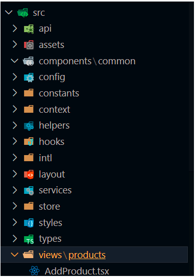
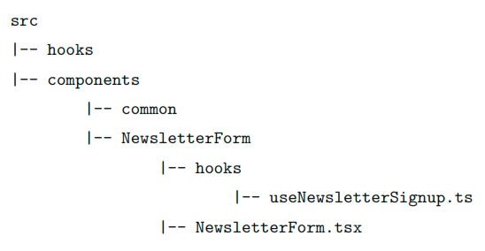
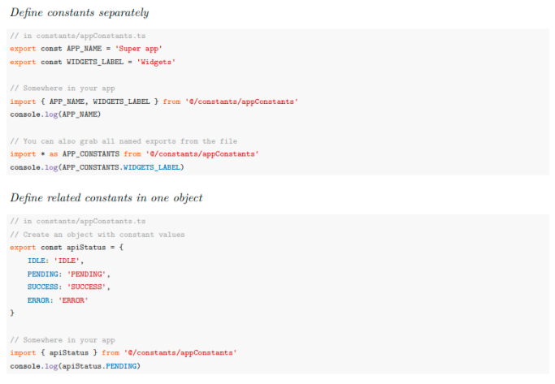

### Recommended Structure



Short Explaination :
**api** : responsible for performing API Requests and Communicating with a server
**assets**: contains **fonts***, **images**, and **icons** for used throughout the app
**common**: contains **component** that are commonly used throughout the app
**hooks**: contains custom hook and reusable



**context**: responsible for holding global-level context state Provider
**layout**: responsible for managing layout, it can type Boxed, Horizontal or Vertical Layout
**config**: responsible for holding configuration from third-party library
**constants**: responsible for holding constant variable that are used throughout the app.



**helpers**: any utilities and small reusable functions.
**intl**: I nternationalizatio n known as i18n. for This content can include but not be limited to translated text or specific format of dates, time, and currency. For instance, whilst the UK uses DD/MM/YYYY format, the US uses MM/DD/YYYY.
**services**: for handle business logic code. (?)
**store**: responsible for handling state management like Redux, Zustand
**styles**: contain styling
**types**: contain global and shareable types
**views**: contain view and routes for application

### Recommended Handling Route Group

```tsx
<Route path="/products">
	<Route index element={<Products />} />
	<Route path="add" element={<AddProduct />}
	<Route path=":id/edit" element={<EditProduct />} />
	<Route path=":id/delete" element={<DeleteProduct />} />
	<Route path=":id" element={<ViewProduct />} />
</Route>
```

All files that are related to the product feature are now kept together.


### Encapsulating components and business logic

Separate Versions

src
	|-- components
		|-- common
		|-- products
				|-- ProductForm.tsx
	|-- services
		|-- productFormService.ts
	|-- helpers
		|-- productFormUtils.ts
	|-- views
		|-- products
			|-- Products.tsx
			|-- ViewProduct.tsx
			|-- AddProduct.tsx
			|-- EditProduct.tsx
			|-- DeleteProduct.tsx

Enclose Together Version

src
|-- views
	|-- products
		|-- components
			|-- productForm
				|-- ProductForm.tsx
				|-- productFormService.ts
				|-- productFormUtils.ts
		|-- helpers
			|-- productUtils.ts
		|-- services
			|-- productService.ts
	|-- Products.tsx
	|-- ViewProduct.tsx
	|-- AddProduct.tsx
	|-- EditProduct.tsx
	|-- DeleteProduct.tsx

* **Problem:** Deciding where to place reusable components and their related files (like services and utilities) within a project structure.
* **Example:** A `ProductForm` component is needed for both `AddProduct` and `EditProduct` pages.
* **Potential solution:**
  * Place the `ProductForm` component in the `components` folder for reusability.
  * Place the `productFormService` in the `services` folder for business logic.
  * Place utility functions in the `helpers` folder.
* **Question:** Is this the best approach for organizing these files?
